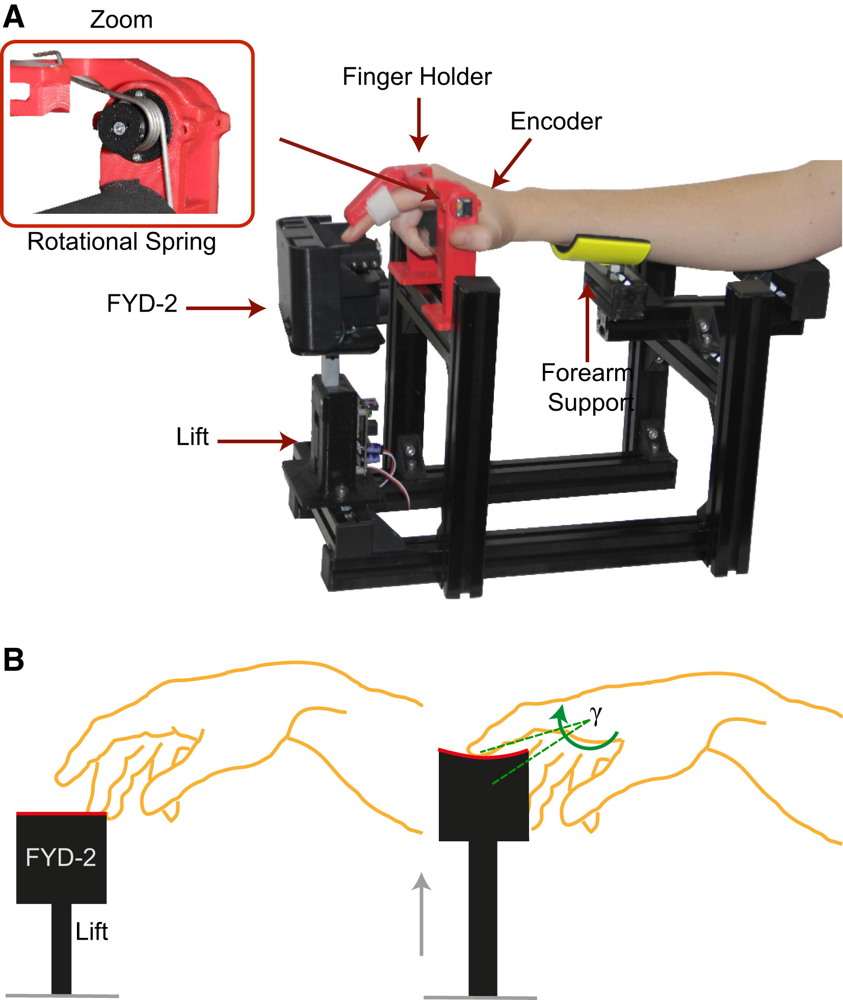

## Neuroscience Haptics and more {.tabset .tabset-fade .tabset-pills}

The __Touch and Motor Control Lab__, led by Alessandro Moscatelli, studies how humans perceive and control hand movements through the integration of multiple sensory signals. We focus on haptics, touch, and the motor control of the hand, with a particular interest in how tactile, visual, and proprioceptive cues are combined to support perception and action. Our research has shown, for example, that tactile feedback can act as an auxiliary source of proprioception, that fingertip contact area changes provide useful information for movement control, and that slip and texture cues can bias hand trajectories. To investigate these processes, we combine psychophysics and behavioral experiments with advanced statistical modeling, including Generalized Linear Mixed Models and Bayesian inference. This rigorous quantitative approach allows us to characterize the integration of sensory information and its role in guiding both perception and motor behavior. Current projects explore how tactile and visual motion cues are fused, how the hand adapts when sensory feedback is altered, and how illusions of touch and motion can reveal the predictive mechanisms of the sensorimotor system.

```{r, echo = FALSE, out.width='40%', fig.margin = TRUE, fig.cap= 'from: (Moscatelli et al., 2016)'}

```


### Selected Pubblications

Ryan, C. P., Ciotti, S., Balestrucci, P., Bicchi, A., Lacquaniti, F., Bianchi, M., Moscatelli, A. (2024). [The relativity of reaching: Motion of the touched surface alters the trajectory of hand movements](https://www.cell.com/iscience/fulltext/S2589-0042(24)01093-9). Iscience, 27(6).

Moscatelli, A., Bianchi, M., Ciotti, S., Bettelani, G. C., Parise, C. V., Lacquaniti, F., Bicchi, A. (2019). [Touch as an auxiliary proprioceptive cue for movement control](https://advances.sciencemag.org/content/5/6/eaaw3121). Science advances, 5(6), eaaw3121.

Moscatelli, A., Bianchi, M., Serio, A., Terekhov, A., Hayward, V., Ernst, M. O., Bicchi, A. (2016) [The Change in Fingertip Contact Area as a Novel Proprioceptive Cue](http://dx.doi.org/10.1016/j.cub.2016.02.052). Current Biology, 26, 1159-1163 

Dallmann, C.J., Ernst, M.O., Moscatelli, A. (2015) [The role of vibration in tactile speed perception](http://doi.org/10.1152/jn.00621.2015). Journal of Neurophysiology, 114(6), 3131-3139.  

Moscatelli, A., Mezzetti, M., and Lacquaniti, F. (2012). [Modeling psychophysical data at the population-level: The generalized linear mixed model](https://doi.org/10.1167/12.11.26). Journal of Vision 12:26, 1-17.


### Funded Projects

_2024 - 2026_ 

Italian grant PRIN: PROGETTI DI RICERCA DI RILEVANTE INTERESSE NAZIONALE.
Title of the project: "COordination and iNtegration of motion in the TACTile and motor system - CONTACT". Settore SH4; Codice Progetto 2020EL3FZL. Responsabile dell’Unita di Ricerca Dipartimento di Medicina dei Sistemi, Universita degli Studi di Roma Tor Vergata.

_2022 - 2026_

Team Leader (Haptics Team - Santa Lucia Foundation Unit) in Horizon RIA grant: [HARIA HUMAN-ROBOT SENSORIMOTOR AUGMENTATION WEARABLE SENSORIMOTOR INTERFACES](https://clem.diism.unisi.it/~haria/) (Proposal number: 101070292).

_Previous funded projects_

Principal investigator in the research project ‘Understanding tactile motion for rendering’, founded by and in collaboration with Facebook Reality lab (Facebook Inc.), and in collaboration with the University of Pisa.

Work Package leader in the project "TIGHT: Tactile InteGration for Humans and arTificial systems" (Italian PRIN project; grant number: 2017SB48FP).

Co-investigator in the European projects "THE: The Hand Embodied" and "WearHap".


### People

_Group Leader_

Alessandro Moscatelli

_Post Docs_

Priscilla Balestrucci, Ph.D.

Sylvain Famié, Ph.D.

_Ph.D. Students_

Aurelia Schirripa (with [Viviana Betti](https://www.cosynclab.it/lab-members.html) )

Anna Vitale (with [Monica Gori](https://u-vip.iit.it/people-details/-/people/monica-gori) )

_Master Students_

Alessio Lin

Alice Flamini

Domenica Mele

Fanny Valente

Francesca Campana

Giulia Daniele

Raffaella Santucci
